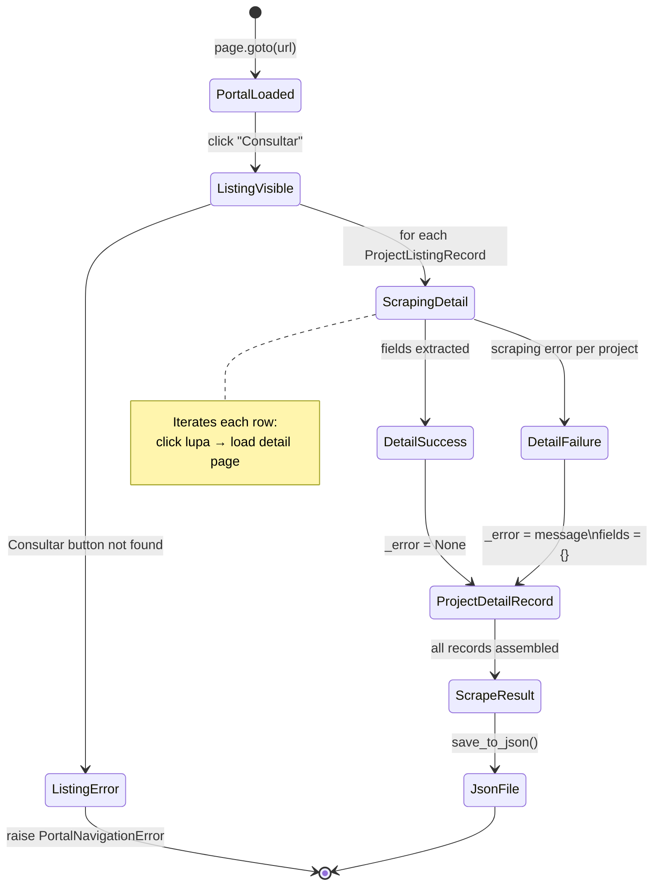

# Data Model: Transparency Portal Scraper Library

**Feature**: 001-transparency-scraper
**Date**: 2026-05-16

---

## Entity: ProjectListingRecord

Represents one row extracted from the portal's project listing table (after clicking
"Consultar").

| Field | Type | Required | Description |
|-------|------|----------|-------------|
| `id` | `str` | Yes | Unique project identifier extracted from listing row |
| `name` | `str` | Yes | Project display name as shown in the listing |
| `raw_row` | `dict[str, str]` | Yes | All raw column values from the listing row, keyed by column header |

**Validation rules**:
- `id` MUST be non-empty string.
- `name` MUST be non-empty string.
- `raw_row` MAY be empty dict if listing columns cannot be mapped.

**Notes**:
- `id` is derived from the row's unique identifier (e.g., a code column or link
  parameter). If no clear ID exists, a sequential index is used and documented.

---

## Entity: ProjectDetailRecord

Represents all data scraped from a project's detail view (after clicking the lupa).
Extends the listing record with full field extraction.

| Field | Type | Required | Description |
|-------|------|----------|-------------|
| `id` | `str` | Yes | Same identifier as `ProjectListingRecord.id` |
| `name` | `str` | Yes | Project name |
| `fields` | `dict[str, str]` | Yes | All labelled fields from detail view; Portuguese keys |
| `_source_url` | `str` | Yes | URL of the detail page or portal URL at time of scrape |
| `_scraped_at` | `str` | Yes | ISO 8601 timestamp of when the record was scraped |
| `_error` | `str \| None` | No | Error message if detail scraping failed; None on success |

**Validation rules**:
- `fields` MUST contain at least one entry on successful scrape.
- `_scraped_at` MUST be ISO 8601 format (`YYYY-MM-DDTHH:MM:SS`).
- If `_error` is set, `fields` MAY be empty.

**Serialization**:
- Serialized to JSON as a flat object. `fields` values are serialized inline
  (not nested) by merging into the root object, with `_source_url`, `_scraped_at`,
  and `_error` as reserved keys.
- Example:
  ```json
  {
    "id": "PRJ-001",
    "name": "Projeto Exemplo",
    "Situação": "Em andamento",
    "Valor Total": "R$ 500.000,00",
    "_source_url": "https://facto.conveniar.com.br/portaltransparencia/",
    "_scraped_at": "2026-05-16T14:30:00",
    "_error": null
  }
  ```

---

## Entity: ScrapeResult

Aggregate output of a full scraping run.

| Field | Type | Required | Description |
|-------|------|----------|-------------|
| `records` | `list[ProjectDetailRecord]` | Yes | All scraped records (successful and failed) |
| `total` | `int` | Yes | Total number of projects found in listing |
| `success_count` | `int` | Yes | Number of records scraped without error |
| `error_count` | `int` | Yes | Number of records with `_error` set |
| `started_at` | `str` | Yes | ISO 8601 timestamp of run start |
| `completed_at` | `str` | Yes | ISO 8601 timestamp of run completion |

**Validation rules**:
- `total == success_count + error_count` MUST hold.
- `records` length MUST equal `total`.

---

## State Transitions



---

## Relationships

```
ScrapeResult
  └─ records: list[ProjectDetailRecord]
                └─ derived from: ProjectListingRecord
```

ProjectListingRecord and ProjectDetailRecord share `id` and `name` as identity
fields. `ProjectDetailRecord` is the canonical output entity; `ProjectListingRecord`
is transient (used only during the scraping process).
