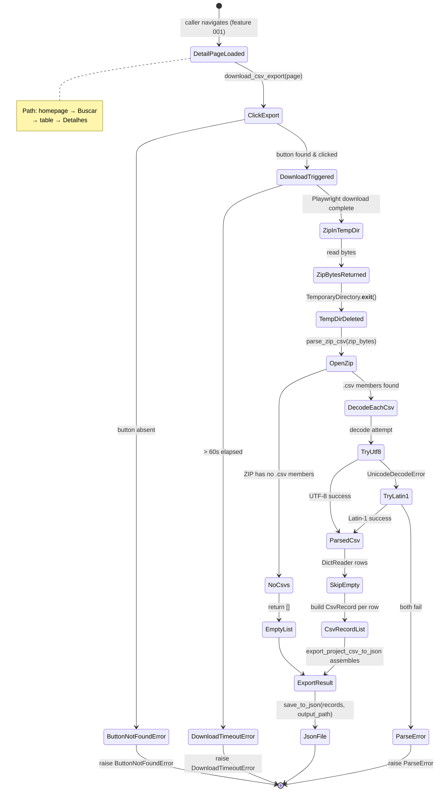

# Data Model: CSV Export to JSON Processor

**Feature**: 002-csv-export-to-json
**Date**: 2026-05-16

---

## Entity: CsvRecord (Value Object)

One row parsed from a CSV file inside the downloaded ZIP.

| Field | Type | Required | Description |
|-------|------|----------|-------------|
| `fields` | `dict[str, str]` | Yes | All column values; Portuguese headers as keys |
| `_source_file` | `str` | Yes | CSV filename inside the ZIP |
| `_extracted_at` | `str` | Yes | ISO 8601 timestamp of extraction |

**Validation rules**:
- `_source_file` MUST be non-empty.
- `_extracted_at` MUST be ISO 8601 (`YYYY-MM-DDTHH:MM:SS`).
- `fields` MAY be empty if CSV row had no parseable values.
- Missing columns (row shorter than header) default to `""`.
- Empty rows MUST NOT produce a `CsvRecord` (skipped silently).

**Immutability**: frozen dataclass — no mutation after creation.

**Serialization**:
```json
{
  "Código": "PRJ-001",
  "Situação": "Em andamento",
  "Valor": "500000",
  "_source_file": "projeto_001.csv",
  "_extracted_at": "2026-05-16T14:35:00"
}
```
Fields from `fields` dict are merged into root object at serialization time.

---

## Entity: ExportResult (Value Object)

Aggregate output of a full export run for one project detail page.

| Field | Type | Required | Description |
|-------|------|----------|-------------|
| `records` | `tuple[CsvRecord, ...]` | Yes | All parsed records |
| `total_records` | `int` | Yes | Total row count across all CSVs |
| `files_processed` | `int` | Yes | Number of CSV files parsed from ZIP |
| `errors` | `tuple[str, ...]` | Yes | Error messages if any stage failed (empty on full success) |
| `exported_at` | `str` | Yes | ISO 8601 timestamp of export start |

**Validation rules**:
- `total_records == len(records)` MUST hold.
- `files_processed >= 1` on successful export; `0` if ZIP contained no CSVs.
- `errors` is empty tuple on full success.

**Immutability**: frozen dataclass.

---

## Entity: ExportError (Exception hierarchy)

```
FactoLibError (base — from feature 001)
  └── ExportError
        ├── DownloadTimeoutError    # download exceeded 60s
        ├── ButtonNotFoundError     # "Exportar em CSV" not on page
        └── ParseError              # ZIP corrupt or CSV unparseable
```

Each subclass carries `stage: str` and `reason: str` attributes for clear error messages.

---

## State Transitions



---

## Relationships

```
ExportResult
  └── records: tuple[CsvRecord, ...]
                └── fields: dict[str, str]  ← CSV row data
                └── _source_file            ← CSV filename in ZIP
                └── _extracted_at           ← timestamp
```

`CsvRecord` is the canonical output entity. `ExportResult` is the container
returned by `export_project_csv_to_json()`.
