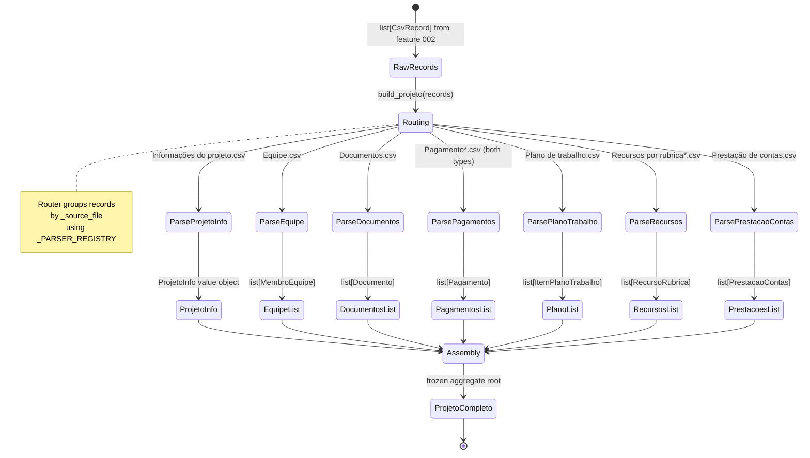
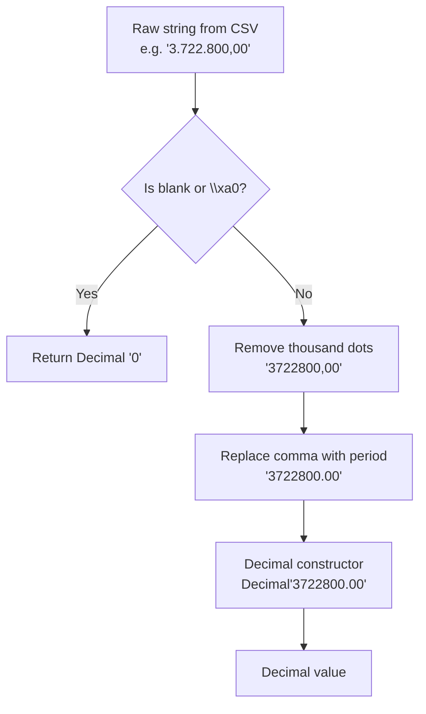

# Data Model: Structured Project Domain Model

**Feature**: 003-project-domain-model
**Date**: 2026-05-16

---

## Entity Hierarchy

```
ProjetoCompleto (Aggregate Root)
├── info: ProjetoInfo
├── equipe: list[MembroEquipe]
├── documentos: list[Documento]
├── pagamentos: list[Pagamento]
├── plano_trabalho: list[ItemPlanoTrabalho]
├── recursos: list[RecursoRubrica]
└── prestacoes_contas: list[PrestacaoContas]
```

All entities are **frozen dataclasses** (Value Objects — immutable after creation).

---

## Entity: ProjetoInfo

Source: `Informações do projeto.csv`
One record per project.

| Field | Type | Required | Source Column |
|-------|------|----------|---------------|
| `referencia` | `str` | Yes | `Referência do projeto` (normalized to number only, e.g., `"372"`) |
| `coordenador` | `str` | Yes | `Coordenador` |
| `financiadora` | `str` | Yes | `Financiadora` |
| `data_inicio` | `datetime.date` | Yes | `Data de início` (DD/MM/YYYY) |
| `data_vigencia` | `datetime.date` | Yes | `Data de vigência` (DD/MM/YYYY) |
| `data_encerramento` | `datetime.date \| None` | No | `Data de encerramento` |
| `tipo` | `str` | Yes | `Tipo de Projeto` |
| `instituicao_executora` | `str` | Yes | `Instituição executora` |
| `departamento` | `str \| None` | No | `Departamento` |
| `processo` | `str \| None` | No | `Processo e sub-processo` |
| `valor_aprovado` | `Decimal` | Yes | `Valor aprovado` (Brazilian money format) |
| `objetivo` | `str` | Yes | `Objetivo/Objeto/Título` |

**Validation rules**:
- `referencia` extracted as the numeric prefix of the full reference string (e.g., `"372 - Estudos de Impacto..."` → `"372"`).
- `valor_aprovado` MUST be `Decimal`; Brazilian format `3.722.800,00` → `Decimal("3722800.00")`.
- `data_encerramento` MAY be `None` if the project is still active.
- `\xa0` in any field normalized to `None` for optional fields.

---

## Entity: MembroEquipe

Source: `Equipe.csv`
Multiple records per project (19 for Projeto 372).

| Field | Type | Required | Source Column |
|-------|------|----------|---------------|
| `referencia` | `str` | Yes | `Referência do projeto` (normalized) |
| `nome` | `str` | Yes | `Nome` |
| `funcao` | `str` | Yes | `Função` (e.g., "Bolsista", "Coordenador") |
| `instituicao` | `str \| None` | No | `Instituição de trabalho` |
| `vinculo` | `str \| None` | No | `Vínculo com a instituição` |
| `grau_instrucao` | `str \| None` | No | `Grau de instrução` |
| `carga_horaria` | `str \| None` | No | `Carga horária` |
| `vinculada_executora` | `bool` | Yes | `Vinculada à inst. executora` ("Sim" → `True`, "Não" → `False`) |

**Validation rules**:
- `vinculada_executora`: "Sim" → `True`; any other value including blank → `False`.
- Optional string fields: `\xa0` normalized to `None`.

---

## Entity: Documento

Source: `Documentos.csv`

| Field | Type | Required | Source Column |
|-------|------|----------|---------------|
| `referencia` | `str` | Yes | `Referência do projeto` |
| `titulo` | `str` | Yes | `Título do Arquivo` |
| `descricao` | `str \| None` | No | `Descrição` |

---

## Entity: Pagamento

Source: `Pagamento de pessoa física.csv` **and** `Pagamento de servidores ou agentes públicos.csv`
Both CSVs share identical column schema and are merged into a unified list.

| Field | Type | Required | Source Column |
|-------|------|----------|---------------|
| `referencia` | `str` | Yes | `Referência do projeto` |
| `cpf` | `str` | Yes | `CPF` (stored masked, e.g., `***.506.767-**`) |
| `nome_favorecido` | `str` | Yes | `Nome do Favorecido` |
| `tipo_pagamento` | `str` | Yes | `Tipo de Pagamento` |
| `data_pagamento` | `datetime.date` | Yes | `Data do Pagamento` (DD/MM/YYYY) |
| `mes_competencia` | `str` | Yes | `Mês de Competência` (e.g., "01/2026") |
| `valor` | `Decimal` | Yes | `Valor` (Brazilian money format) |
| `tipo_favorecido` | `str` | Yes | `"pessoa_fisica"` or `"servidor"` (derived from `_source_file`) |

**Validation rules**:
- `tipo_favorecido` derived from `_source_file`: `"pessoa física"` in filename → `"pessoa_fisica"`, else → `"servidor"`.
- `valor` MUST be `Decimal`; never `float`.
- CPF stored as-is — no unmasking.

---

## Entity: ItemPlanoTrabalho

Source: `Plano de trabalho.csv`
Largest entity (185 rows for Projeto 372).

| Field | Type | Required | Source Column |
|-------|------|----------|---------------|
| `referencia` | `str` | Yes | `Referência do projeto` |
| `agrupamento` | `str \| None` | No | `Agrupamento` |
| `rubrica` | `str` | Yes | `Rubrica` |
| `codigo` | `str \| None` | No | `Código` (`\xa0` → `None`) |
| `produto` | `str \| None` | No | `Produto` |
| `descricao` | `str \| None` | No | `Descrição` |
| `justificativa` | `str \| None` | No | `Justificativa` |
| `qtde_aprovada` | `str \| None` | No | `Qtde aprovada` |
| `valor_unitario` | `Decimal \| None` | No | `Valor unitário` |
| `valor_total_aprovado` | `Decimal` | Yes | `Valor total aprovado` |
| `valor_executado` | `Decimal` | Yes | `Valor executado` (may be `0` if not yet executed) |

**Validation rules**:
- `codigo`: `\xa0` normalized to `None`.
- Decimal fields: blank or `\xa0` → `Decimal("0")` (treat as zero, not error).

---

## Entity: RecursoRubrica

Source: `Recursos por rubrica receita separada.csv`

| Field | Type | Required | Source Column |
|-------|------|----------|---------------|
| `referencia` | `str` | Yes | `Referência do projeto` |
| `tipo_rubrica` | `str` | Yes | `Tipo da Rubrica` (e.g., "Despesa", "Receita") |
| `rubrica` | `str` | Yes | `Rubrica` |
| `aprovado` | `Decimal` | Yes | `Aprovado` |
| `liberado` | `Decimal` | Yes | `Liberado` |
| `executado` | `Decimal` | Yes | `Executado` |
| `moeda` | `str` | Yes | `Moeda` |

---

## Entity: PrestacaoContas

Source: `Prestação de contas.csv`

| Field | Type | Required | Source Column |
|-------|------|----------|---------------|
| `referencia` | `str` | Yes | `Referência do projeto` |
| `titulo` | `str` | Yes | `Título do Arquivo` |
| `descricao` | `str \| None` | No | `Descrição` |
| `data_inicio` | `datetime.date` | Yes | `Data início` (DD/MM/YYYY) |
| `data_final` | `datetime.date` | Yes | `Data final` (DD/MM/YYYY) |

---

## Entity: ProjetoCompleto (Aggregate Root)

| Field | Type | Required |
|-------|------|----------|
| `info` | `ProjetoInfo` | Yes |
| `equipe` | `tuple[MembroEquipe, ...]` | Yes (may be empty) |
| `documentos` | `tuple[Documento, ...]` | Yes (may be empty) |
| `pagamentos` | `tuple[Pagamento, ...]` | Yes (may be empty) |
| `plano_trabalho` | `tuple[ItemPlanoTrabalho, ...]` | Yes (may be empty) |
| `recursos` | `tuple[RecursoRubrica, ...]` | Yes (may be empty) |
| `prestacoes_contas` | `tuple[PrestacaoContas, ...]` | Yes (may be empty) |

**Invariant**: `info.referencia` MUST match the `referencia` of all sub-entities.

---

## State Transitions



---

## Money Parsing Flow



---

## Relationships

```
ProjetoCompleto
├── 1 ── ProjetoInfo           (project metadata)
├── * ── MembroEquipe           (team members, join by referencia)
├── * ── Documento              (attached files)
├── * ── Pagamento              (payments — 2 source CSV types merged)
├── * ── ItemPlanoTrabalho      (work plan lines)
├── * ── RecursoRubrica         (budget by category)
└── * ── PrestacaoContas        (accountability reports)
```

`CsvRecord` (from `factor_lib.export`) is the INPUT type — parsed and discarded.
`ProjetoCompleto` and its sub-entities are the OUTPUT type — immutable domain objects.
